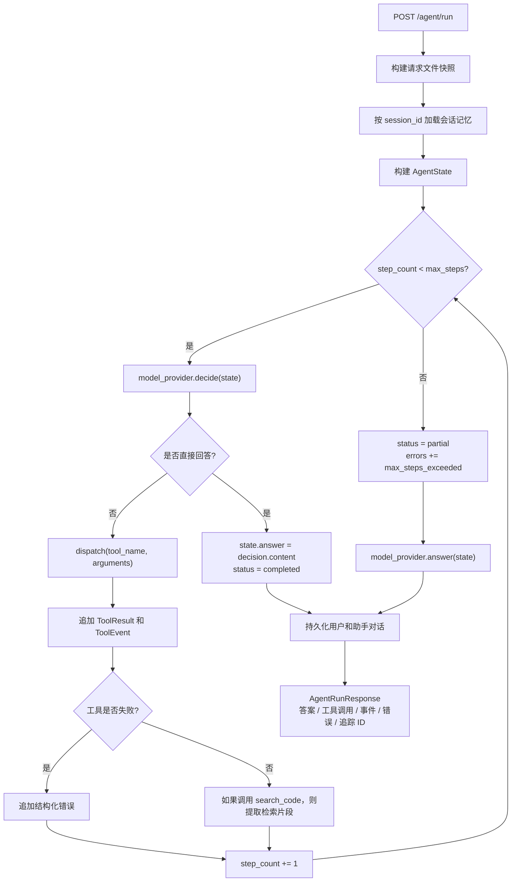
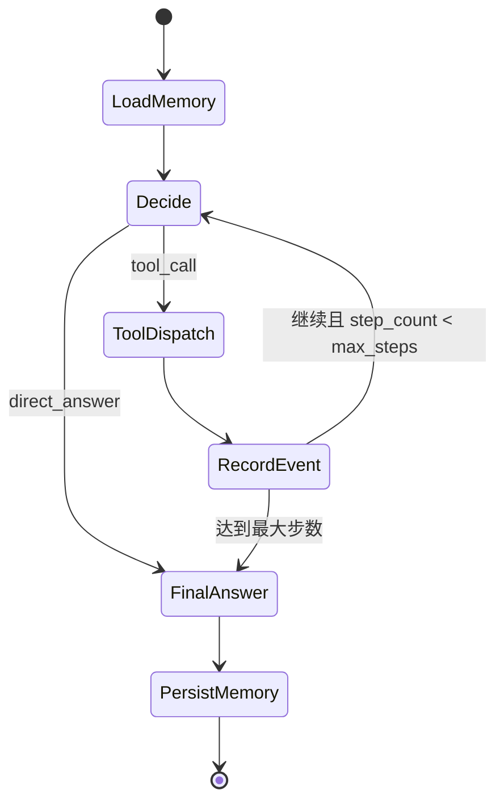

# Agent / LangGraph 流程证据

本文档记录 `codebase-agent` 当前 Agent 执行流程，并把它映射到 LangGraph 风格的状态机。当前运行时由 `codebase_agent/agent/runner.py` 手写实现；下面的图用于说明状态流和后续迁移边界，不表示项目已经强依赖 LangGraph。

## 当前 Agent 运行流程

## 与 LangGraph 的对应关系

| 当前实现 | LangGraph 概念 | 作用 |
| --- | --- | --- |
| `AgentState` 数据类 | 图状态结构 | 保存问题、答案、工具调用、结果、事件、错误和记忆上下文 |
| `model_provider.decide(state)` | 模型决策节点 | 决定直接回答还是调用工具 |
| `dispatch(...)` | 工具节点 | 执行列文件、读文件或搜代码工具 |
| `step_count < max_steps` | 条件边 / 保护条件 | 防止无限循环和失控工具调用 |
| `model_provider.answer(state)` | 最终回答节点 | 根据已收集的工具结果生成回复 |
| `ToolEvent` 列表 | 可观测状态 | 记录工具名、是否成功、耗时、错误类型和追踪 ID |
| `AgentMemoryStore` | 外部持久化节点 | 加载并追加会话级对话记忆 |

## LangGraph 风格目标形态

## 架构说明

项目当前没有直接把主流程写成 LangGraph，而是先手写 Agent runner。这样做的目的，是把核心控制流暴露清楚：状态、模型决策、工具分发、事件记录、循环保护和最终回答。这样更容易测试，也便于后续迁移到图状态框架。

如果后续迁移到 LangGraph，它替换的是编排层，不会替换工具、记忆、RAG 检索和错误处理。因为当前每个函数已经能对应到一个图节点或条件边，迁移路径比较直接。

## 边界设计

- 模型可以决定调用哪个已注册工具，但不能调用任意函数。
- `max_steps` 是防止无限循环的硬保护。
- 工具错误会记录为结构化事件，默认不让整个进程崩掉。
- `session_id` 记忆是会话级对话记忆，不是用户画像。
- 高风险动作必须人工确认；当前项目只读取请求内文件快照，并做检索和分析。
