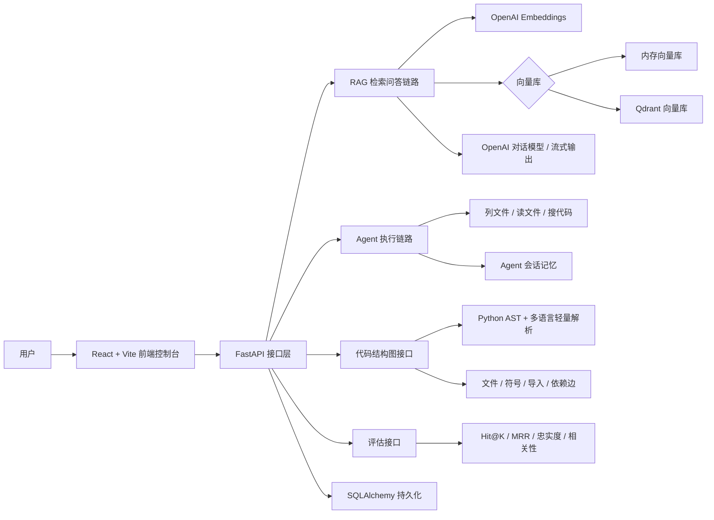
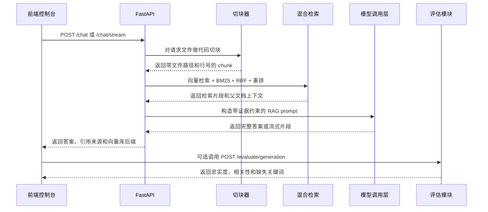
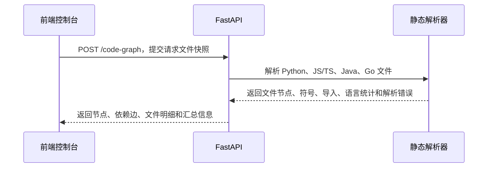
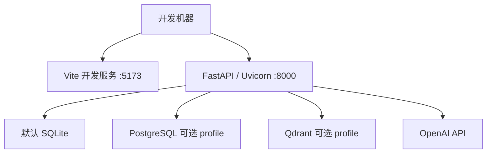

# 架构图说明

## 系统架构

```mermaid
flowchart LR
    U["用户"] --> FE["React + Vite 前端控制台"]
    FE --> API["FastAPI 接口层"]
    API --> RAG["RAG 检索问答链路"]
    API --> AG["Agent 执行链路"]
    API --> CG["代码结构图接口"]
    API --> EV["评估接口"]
    API --> DB["SQLAlchemy 持久化"]
    RAG --> EMB["OpenAI Embeddings"]
    RAG --> VS{"向量库"}
    VS --> MEM["内存向量库"]
    VS --> QD["Qdrant 向量库"]
    RAG --> LLM["OpenAI 对话模型 / 流式输出"]
    AG --> TOOLS["列文件 / 读文件 / 搜代码"]
    AG --> AM["Agent 会话记忆"]
    CG --> AST["Python AST + 多语言轻量解析"]
    CG --> STRUCT["文件 / 符号 / 导入 / 依赖边"]
    EV --> METRICS["Hit@K / MRR / 忠实度 / 相关性"]
```

## RAG 请求流程

```mermaid
sequenceDiagram
    participant FE as 前端控制台
    participant API as FastAPI
    participant CK as 切块器
    participant RET as 混合检索
    participant LLM as 模型调用层
    participant EV as 评估模块

    FE->>API: POST /chat 或 /chat/stream
    API->>CK: 对请求文件做代码切块
    CK-->>API: 返回带文件路径和行号的 chunk
    API->>RET: 向量检索 + BM25 + RRF + 重排
    RET-->>API: 返回检索片段和父文档上下文
    API->>LLM: 构造带证据约束的 RAG prompt
    LLM-->>API: 返回完整答案或流式片段
    API-->>FE: 返回答案、引用来源和向量库后端
    FE->>EV: 可选调用 POST /evaluate/generation
    EV-->>FE: 返回忠实度、相关性和缺失关键词
```

## 代码结构图流程

```mermaid
sequenceDiagram
    participant FE as 前端控制台
    participant API as FastAPI
    participant AST as 静态解析器

    FE->>API: POST /code-graph，提交请求文件快照
    API->>AST: 解析 Python、JS/TS、Java、Go 文件
    AST-->>API: 返回文件节点、符号、导入、语言统计和解析错误
    API-->>FE: 返回节点、依赖边、文件明细和汇总信息
```

## 部署视图

```mermaid
flowchart TB
    DEV["开发机器"] --> VITE["Vite 开发服务 :5173"]
    DEV --> API["FastAPI / Uvicorn :8000"]
    API --> SQLITE["默认 SQLite"]
    API --> PG["PostgreSQL 可选 profile"]
    API --> QD["Qdrant 可选 profile"]
    API --> OPENAI["OpenAI API"]
```
